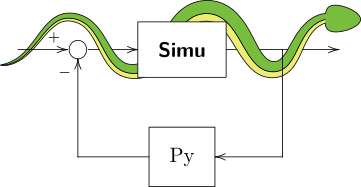

|simupy_logo|
=============

.. image:: https://img.shields.io/pypi/v/simupy.svg
    :alt: PyPI Package latest release
    :target: https://pypi.python.org/pypi/simupy

.. image:: https://readthedocs.org/projects/simupy/badge/?style=flat
    :target: https://simupy.readthedocs.io/en/latest/
    :alt: Documentation Status

.. image:: https://travis-ci.org/simupy/simupy.svg?branch=master
    :alt: Travis-CI Build Status
    :target: https://travis-ci.org/simupy/simupy

.. image:: https://codecov.io/gh/simupy/simupy/branch/master/graph/badge.svg
  :alt: Coverage Status
  :target: https://codecov.io/gh/simupy/simupy

.. |API documentation| replace:: `API Documentation`_
.. _API Documentation: https://simupy.readthedocs.io/en/latest/api/api.html

SimuPy is a framework for simulating interconnected dynamical system models and
provides an open source, python-based tool that can be used in model- and
system- based design and simulation workflows. Dynamical system models can be
specified as an object with the interface described in the 
|API documentation|. Models can also be constructed using symbolic
expressions, as in

.. code-block :: python

    from sympy.physics.mechanics import dynamicsymbols
    from sympy.tensor.array import Array
    from simupy.systems.symbolic import DynamicalSystem

    x = x1, x2, x3 = Array(dynamicsymbols('x1:4'))
    u = dynamicsymbols('u')
    sys = DynamicalSystem(Array([-x1+x2-x3, -x1*x2-x2+u, -x1+u]), x, u)

which will automatically create callable functions for the state equations,
output equations, and jacobians. By default, the code generator uses a wrapper
for ``sympy.lambdify``. You can change it by passing the system initialization
arguments ``code_generator`` (the function) and additional keyword arguments
to the generator in a dictionary ``code_generator_args``. You can change the
defaults for future systems by changing the module variables

.. code-block :: python

   import simupy.systems.symbolic
   simupy.systems.symbolic.DEFAULT_CODE_GENERATOR = your_code_generator_function
   simupy.systems.symbolic.DEFAULT_CODE_GENERATOR_ARGS = {'extra_arg': value}

A number of helper classes/functions exist to simplify the construction of
models. For example, a linear feedback controller can be defined as

.. code-block :: python

   from simupy.systems import LTISystem
   ctrl = LTISystem([[1.73992128, 0.99212953,  -2.98819041]])

The gains in the example come from the infinite horizon LQR based on the system
linearized about the origin. A block diagram of the system under feedback
control can be constructed

.. code-block :: python

   from simupy.block_diagram import BlockDiagram
   BD = BlockDiagram(sys, ctrl)
   BD.connect(sys, ctrl) # connect the current state to the feedback controller
   BD.connect(ctrl, sys) # connect the controlled input to the system

Initial conditions for systems with non-zero dimensional state can be defined
(it defaults to zeros of the appropriate dimension) and the interconnected
systems can be simulated with the ``BlockDiagram``'s ``simulate`` method,

.. code-block :: python

   sys.initial_condition = [5, -3, 1]
   res = BD.simulate(10)

which uses ``scipy.integrate.ode`` as the default solver for the initial-valued
problem. The results are an instance of the ``SimulationResult`` class, with
array attributes ``t``, ``x``, ``y``, and ``e``, holding time, state, output,
and event values for each integrator time step. The first axis indexes the time
step. For ``x``, ``y``, and ``e``, the second axis indexes the individual
signal components, ordered first by the order each system was added to the
block diagram then according to the system state and output specification. The
simulation defaults to the ``dopri5`` solver with dense output, but a different
``integrator_class`` and ``integrator_options`` options can be used as long as
it supports a subset of the ``scipy.integrate.ode`` API. The default values
used for future simulations can be changed following the pattern for the
symbolic code generator options.

A number of utilities for constructing and manipulating systems and the
simulation results are also included:

- ``process_vector_args`` and ``lambdify_with_vector_args`` from
  ``simupy.utils.symbolic`` are helpers for code generation using
  ``sympy.lambdify``
- ``simupy.utils.callable_from_trajectory`` is a simple wrapper for making
  polynomial spline interpolators using ``scipy.interpolate.splprep``
- ``simupy.matrices`` includes tools for constructing (vector) systems using
  matrix expressions and re-wrapping the results into matrix form
- ``simupy.systems.SystemFromCallable`` is a helper for converting a function
  to a state-less system (typically a controller) to simulate
- ``MemorylessSystem`` and ``LTISystem`` are subclasses to more quickly create
  these types of systems
- ``SwitchedSystem`` is used to construct systems with discontinuities,
  defined by zero-crossings of the ``event_equation_function`` output.

The examples subdirectory includes a number of worked problems. The 
documentation and docstrings are also available for reference.

Installation
------------

Version 1.0 of SimuPy is ``pip`` installable

.. code-block:: bash

   $ pip install simupy

However, the latest features and examples are only available in the development
version. To install,

.. code-block:: bash

  $ git clone https://github.com/simupy/simupy.git 
  $ pip install -e simupy

SimuPy has been tested locally against

 - Python >= 3.6
 - NumPy_ >= 1.11
 - SciPy_ >= 0.18
 - SymPy_ >= 1.0

but tests on Travis may run with newer versions. Much of the functionality
works without SymPy, so installation does not require it. The examples use
matplotlib_ to visualize the results. Testing uses pytest_. The documents are
built with Sphinx_ == 1.6.3.

.. _NumPy: http://numpy.scipy.org
.. _SymPy: http://sympy.org
.. _SciPy: http://www.scipy.org/scipylib/index.html
.. _matplotlib: http://matplotlib.org
.. _pytest: https://docs.pytest.org/en/latest/
.. _Sphinx: http://sphinx-doc.org/

Contributing
------------

1. To discuss problems or feature requests, file an issue. For bugs, please
   include as much information as possible, including operating system, python
   version, and version of all dependencies. 
2. To contribute, make a pull request. Contributions should include tests for
   any new features/bug fixes and follow best practices including PEP8, etc.
